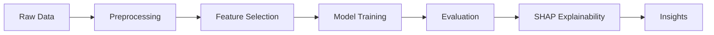

<div align="center">

# Crop Yield Driver Discovery
### Feature Selection × XGBoost × Explainable AI

[](https://python.org)
[](https://xgboost.readthedocs.io)
[](https://shap.readthedocs.io)
[](https://scikit-learn.org)
[](https://github.com)

<br/>

> *Applying Machine Learning to uncover the hidden drivers of crop yield in Indian agriculture — with full explainability via SHAP.*

<br/>

</div>

---

## Overview

Agriculture is a critical sector in India, directly impacting food security and the national economy. Crop yield depends on multiple interacting factors such as climate conditions, soil characteristics, vegetation health, and agricultural practices.

This project applies **Machine Learning** — specifically **XGBoost** combined with **feature selection** and **explainable AI techniques** — to:

- **Predict** crop yield with high accuracy
- **Identify and rank** the most significant yield drivers
- **Select** the best-performing model through rigorous evaluation

> The study focuses on **Indian agricultural data** and follows a reproducible end-to-end machine learning pipeline.

---

## Project Objectives

| # | Objective |
|---|-----------|
| 1 | Identify key factors influencing crop yield using feature selection methods |
| 2 | Train and optimize an XGBoost regression model |
| 3 | Compare XGBoost performance with baseline machine learning models |
| 4 | Interpret model predictions using SHAP (SHapley Additive Explanations) |
| 5 | Generate actionable insights for agricultural decision-making |

---

## Dataset Description

The project utilizes publicly available **Indian agricultural datasets**, which include:

```
 Dataset Sources
 Crop yield data → State/district level
 Weather data → Rainfall, temperature, humidity
 Soil attributes → Nutrient composition, pH
 Remote sensing indices → NDVI, EVI
 Agricultural inputs → Fertilizer usage, area sown
```

** Target Variable:** Crop Yield *(tonnes per hectare)*

---

## Tools & Technologies

<div align="center">

| Category | Tools |
|----------|-------|
| **Language** | Python 3.8+ |
| **Core ML** | XGBoost, Random Forest, Linear Regression |
| **Feature Selection** | Correlation Filtering, RFE, Embedded Importance |
| **Explainability** | SHAP |
| **Data & Viz** | NumPy, Pandas, Matplotlib, Seaborn |
| **Preprocessing** | Scikit-learn |

</div>

---

## Methodology



### 1⃣ Data Preprocessing
- Handling missing values
- Feature scaling and encoding
- Data normalization

### 2⃣ Feature Selection
- **Correlation-based filtering** — remove redundant features
- **Recursive Feature Elimination (RFE)** — iteratively prune weak features
- **Embedded feature importance** — XGBoost's built-in gain scores

### 3⃣ Model Training
- XGBoost regression with hyperparameter tuning
- Cross-validation for robust evaluation

### 4⃣ Model Evaluation

| Metric | Description |
|--------|-------------|
| **RMSE** | Root Mean Squared Error |
| **MAE** | Mean Absolute Error |
| **R²** | Coefficient of Determination |

### 5⃣ Model Explainability
- SHAP values for **global** feature interpretation
- SHAP analysis for **local** prediction explanations
- Visualization of top yield drivers

---

## Results

 XGBoost achieves **superior predictive performance** compared to baseline models 
 Feature selection **improves model stability** and reduces noise 
 SHAP analysis highlights **weather variables and vegetation indices** as dominant yield drivers 
 Results are **interpretable and practically actionable**

---

## Key Insights

> **Rainfall and temperature** strongly influence crop yield 
> **NDVI** is a reliable indicator of crop health 
> **Feature selection** enhances both model performance and interpretability 
> **Explainable AI** bridges the gap between ML outputs and real-world agricultural decisions

---

## Ethical & Practical Considerations

- Model predictions are dependent on **data quality and coverage**
- Outputs should **support, not replace**, expert agricultural guidance
- Responsible interpretation is necessary for **policy-level applications**

---

## Future Scope

- [ ] Crop-specific modeling (rice, wheat, maize)
- [ ] Integration of real-time satellite data
- [ ] Deployment as a web-based decision support system
- [ ] Inclusion of socio-economic variables
- [ ] Time-series forecasting for seasonal yield prediction

---

## References

1. [Smart Agriculture – ScienceDirect (2024)](https://www.sciencedirect.com/science/article/pii/S2772375524003228)
2. [PMC – Crop Yield Prediction Review](https://pmc.ncbi.nlm.nih.gov/articles/PMC11667600/)
3. [Smart Agricultural Technology](https://www.sciencedirect.com/science/article/pii/S2772671124001918)
4. [MDPI Agriculture – ML in Yield Forecasting](https://www.mdpi.com/2077-0472/14/6/794)
5. [Nature – Precision Agriculture 2025](https://www.nature.com/articles/s44264-025-00052-6)

---

## Author

<div align="center">

**Nishant Rajora** 
*Undergraduate – Data Science* 
**The NorthCap University**

[](https://github.com)

</div>

---

## Acknowledgements

This project was developed as part of an **academic evaluation** and is inspired by recent research in machine learning and precision agriculture.

---

<div align="center">
<sub>Made with for better agricultural decisions through data science</sub>
</div>